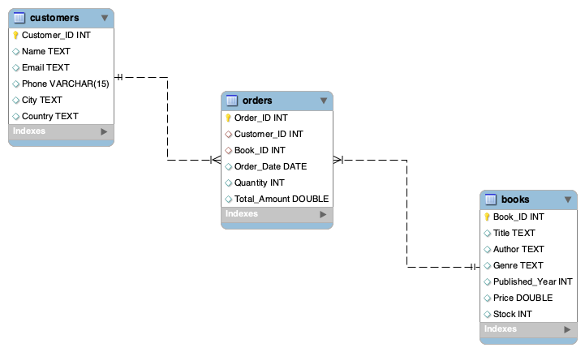

# 📚 Online Bookstore SQL Project

## 📝 Project Overview
This is an *Online Bookstore Database* project using SQL. It manages *Books, Customers, and Orders* tables.  
The project tracks stock, calculates total spending by customers, identifies oversold books, and performs analytical queries using *JOINs and GROUP BY*.

## 🗂 Tables
•⁠  ⁠*Books* – Book details: Title, Author, Genre, Published Year, Price, Stock  
•⁠  ⁠*Customers* – Customer info: Name, Email, Phone, City, Country  
•⁠  ⁠*Orders* – Order info: Customer_ID, Book_ID, Quantity, Order_Date, Total_Amount 

## 👨‍💻 SQL Concept Used
•⁠  ⁠SELECT Statements
•⁠  ⁠Filtering (WHERE)
•⁠  ⁠Aggregations (SUM, AVG, COUNT)
•⁠  ⁠GROUP BY and HAVING
•⁠  ⁠JOINS
•⁠  ⁠Subqueries
•⁠  ⁠CTE (Common Table Expressions)
•⁠  ⁠Window Functions

## 🔍 Key Queries

1.⁠ ⁠*Total spending by each customer*  

SELECT c.Name, c.Customer_ID, ROUND(SUM(o.Total_Amount),2) AS Total_Spent
FROM Orders o
JOIN Customers c ON o.Customer_ID = c.Customer_ID
GROUP BY c.Name, c.Customer_ID
ORDER BY Total_Spent DESC;

2. *Top-selling books*

SELECT b.Book_ID, b.Title, COUNT(o.Order_ID) AS Total_Orders
FROM Orders o
JOIN Books b ON b.Book_ID = o.Book_ID
GROUP BY b.Book_ID, b.Title
ORDER BY Total_Orders DESC;

3. *Stock remaining after all orders*

SELECT b.Book_ID, b.Title, b.Stock AS Original_Stock, 
       COALESCE(SUM(o.Quantity), 0) AS Total_Ordered,
       b.Stock - COALESCE(SUM(o.Quantity),0) AS Remaining_Stock
FROM Books b
LEFT JOIN Orders o ON b.Book_ID = o.Book_ID
GROUP BY b.Book_ID, b.Title, b.Stock;

4. *Top 2 best-selling books in each genre*
       
SELECT *
FROM (
    SELECT b.Genre,
           b.Title,
           SUM(o.Quantity) AS Total_Sold,
           ROW_NUMBER() OVER (
               PARTITION BY b.genre
               ORDER BY SUM(o.Quantity) DESC
           ) AS rn
    FROM Books b
    JOIN Orders o 
    ON b.Book_ID = o.Book_ID
    GROUP BY b.genre, b.Title
) t
WHERE rn <= 2;

5. *Monthly sales and the difference compared to the previous month*

SELECT Month,
       Monthly_Sales,
       ROUND(Monthly_Sales - LAG(Monthly_Sales) 
       OVER (ORDER BY Month),2) AS Sales_Difference
FROM (
    SELECT DATE_FORMAT(Order_Date, '%Y-%m') AS Month,
           ROUND(SUM(Total_Amount),2) AS Monthly_Sales
    FROM Orders
    GROUP BY DATE_FORMAT(Order_Date, '%Y-%m')
) t;

6. *Customers who placed the highest number of orders*

WITH Customer_Orders AS (
    SELECT c.Customer_ID,
           c.Name,
           COUNT(o.Order_ID) AS Total_Orders
    FROM Customers c
    JOIN Orders o
    ON c.Customer_ID = o.Customer_ID
    GROUP BY c.Customer_ID, c.Name
)
SELECT *
FROM Customer_Orders
ORDER BY Total_Orders DESC
LIMIT 3;

7. *The remaining stock using CTE*

WITH Ordered_Quantity AS (
    SELECT Book_ID,
           SUM(Quantity) AS Total_Ordered
    FROM Orders
    GROUP BY Book_ID
)
SELECT b.Book_ID,
       b.Title,
       b.Stock,
       COALESCE(o.Total_Ordered,0) AS Total_Ordered,
       b.Stock - COALESCE(o.Total_Ordered,0) AS Remaining_Stock
FROM Books b
LEFT JOIN Ordered_Quantity o
ON b.Book_ID = o.Book_ID;

📊 Key Insights
1. Top-selling books identified – Some books are consistently ordered more, indicating bestsellers.
2. Oversold books detected – Certain books have orders exceeding stock, showing high demand and potential stock shortages.
3. Stock analysis – Most books have sufficient stock, but a few low-stock items may need reorder.
4. Customer spending patterns – Customers vary in total spending; high-spending customers can be targeted for promotions.
5. Low-demand books – Some books are rarely ordered, indicating low customer interest.
6. Order trends – Analytical queries reveal seasonal or frequent order patterns (e.g., certain months higher sales).

## 🛠 Tools Used
•⁠  ⁠🖥 MySQL Workbench  
•⁠  ⁠💾 SQL  
•⁠  ⁠📄 CSV files

## 🖼 ER Diagram

The following ER Diagram represents the database structure of the Online Bookstore project.  
It shows the relationships between Customers, Orders, and Books tables.

•⁠  ⁠Customers (1) → Orders (Many)
•⁠  ⁠Books (1) → Orders (Many)

This diagram provides a clear visualization of primary keys and foreign key relationships.

🚀 How to Run
1. Open MySQL Workbench
2. Import CSV files using Table Data Import Wizard: Books.csv, Customers.csv, Orders.csv
3. Execute OnlineBookstoreDB.sql to run analytical queries and view results

🔮 Future Enhancements
- Add user authentication and roles for admin and customers
- Implement advanced analytics like monthly sales trends and top genres
- Add automated stock alerts for low-stock books
- Integrate with a frontend application for a complete online bookstore system

✅ Conclusion
- This project demonstrates practical SQL skills for managing an online bookstore database.
- It provides insights into sales trends, customer spending, stock management, and highlights key business decisions.
